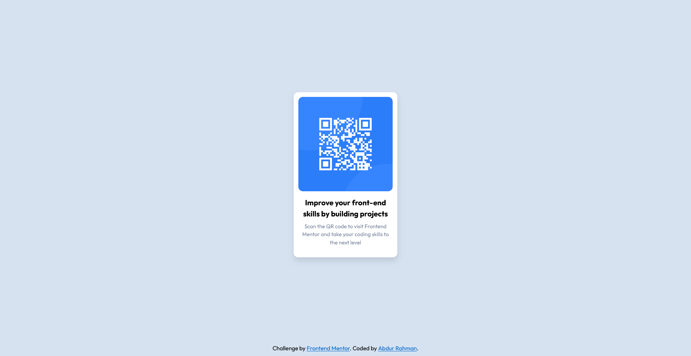

# Frontend Mentor - QR code component solution

This is a solution to the [QR code component challenge on Frontend Mentor](https://www.frontendmentor.io/challenges/qr-code-component-iux_sIO_H). Frontend Mentor challenges help you improve your coding skills by building realistic projects.

## Table of contents

- [Overview](#overview)
  - [Screenshot](#screenshot)
  - [Links](#links)
- [My process](#my-process)
  - [Built with](#built-with)
  - [What I learned](#what-i-learned)
  - [Continued development](#continued-development)
  - [Useful resources](#useful-resources)
- [Author](#author)


## Overview

### Screenshot



### Links

- Solution URL: [Solution](https://github.com/nuraf9607/fm-qr-code-component)
- Live Site URL: [Live Site](https://nuraf9607.github.io/fm-qr-code-component/)

## My process

### Built with

- Semantic HTML5 markup
- CSS custom properties
- CSS Grid

### What I learned

While I was working on this project I tried to write as less code as possible while
getting the desired results, fortunately I was able to do this without writing more code

```html
 <div class="text-content">
    <h1>Improve your front-end skills by building projects</h1>
    <p class="desc">
      Scan the QR code to visit Frontend Mentor and take your coding skills
      to the next level
    </p>
 </div>
```

```css
.b-r {
  border-radius: 0.8rem;
}

```

### Continued development

I have seen so much great use case of grid layouts, but this is something i am still not comfortable using, and want to refine it for the future


### Useful resources

- [CSS Reset](https://www.joshwcomeau.com/css/custom-css-reset/) - This helped to do a complete reset of the project I am working with.


## Author

- Frontend Mentor - [@nuraf9607](https://www.frontendmentor.io/profile/nuraf9607)
- Twitter - [@theAbdurRahman1](https://x.com/theAbdurRahman1)


